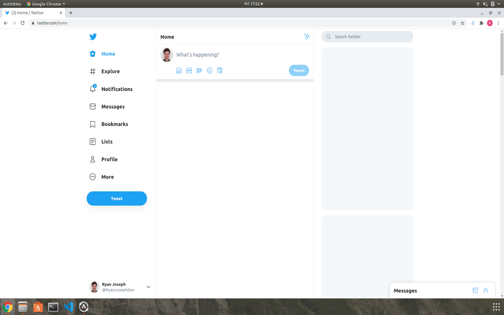
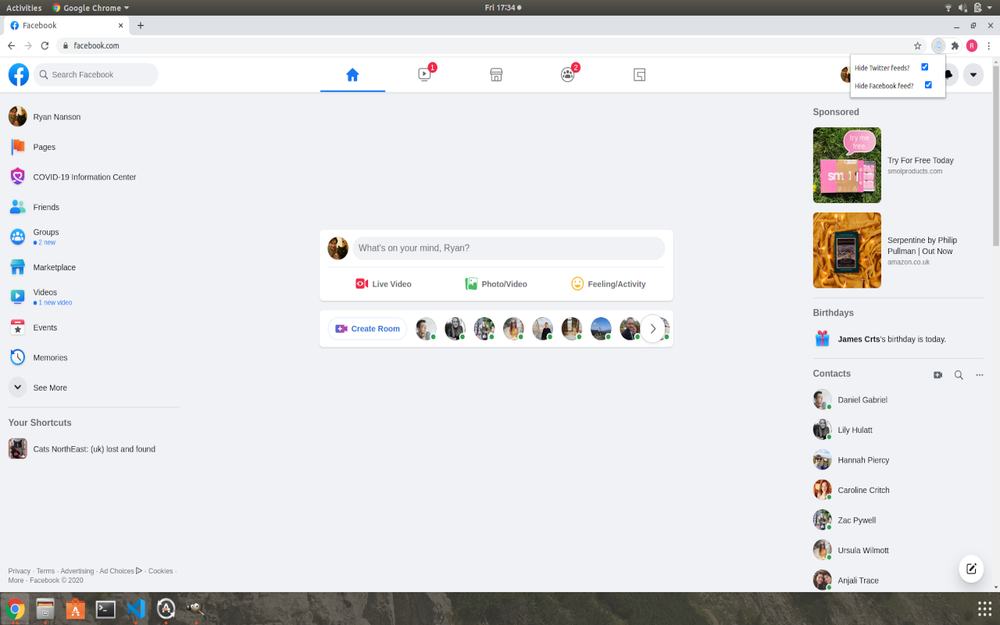
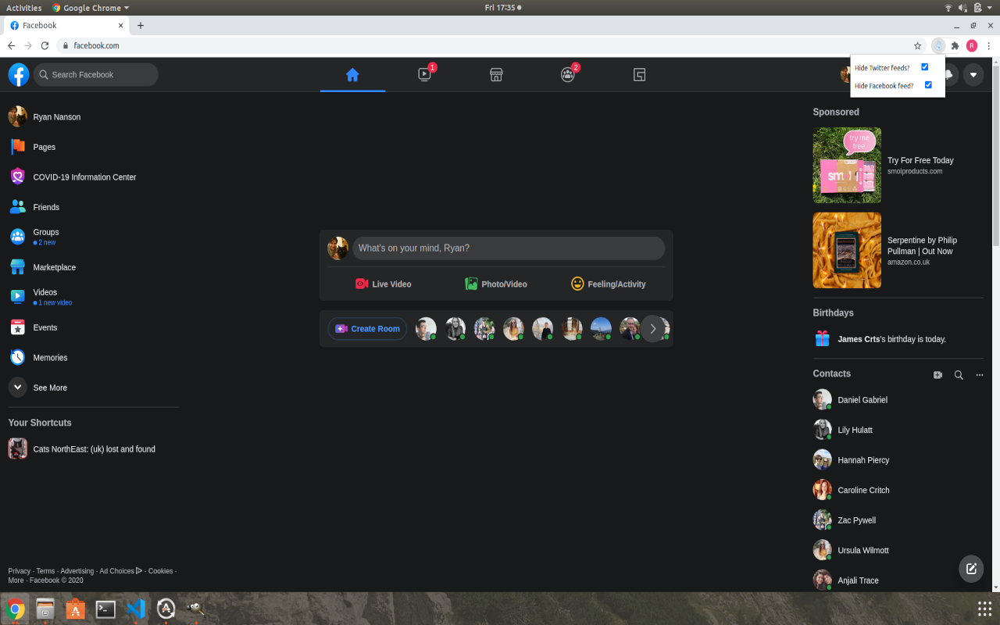

# Healthier-Tech-Habits-Chrome-Extension
Chrome extension giving you the tools to improve your tech habits.

## Features:
* Block feeds on social media sites (Twitter, Facebook and LinkedIn)

## Run Locally
1. Navigate to chrome://extensions
2. Expand the Developer dropdown menu and click “Load Unpacked Extension”
3. Navigate to the local folder containing the extension’s code and click Ok
4. Assuming there are no errors, the extension should load into your browser

## Screenshots

